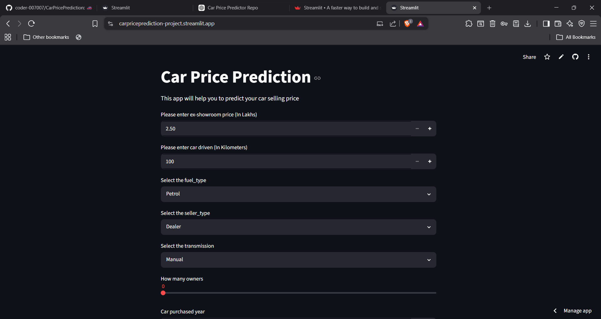

# 🚗 Car Price Prediction Web App

A Machine Learning-powered web application that predicts the selling price of a used car based on various vehicle attributes. This project is built using **Python**, **Streamlit**, and **XGBoost**, providing a simple and interactive interface for users to estimate the resale value of their cars instantly.

---

## 📌 Overview

Determining the right selling price for a used car can be challenging. This application leverages a trained **XGBoost Regression Model** to predict the expected selling price based on factors such as the car's current ex-showroom price, distance traveled, fuel type, transmission type, ownership history, and age.

The application is deployed through **Streamlit**, making it easy to use through a web browser without requiring any technical knowledge.

---

## ✨ Features

### 🔹 Interactive User Interface
- Built with Streamlit for a clean and responsive user experience.
- Simple form-based input system.

### 🔹 Real-Time Price Prediction
- Predicts the estimated resale value instantly.
- Results are displayed immediately after clicking the **Predict** button.

### 🔹 Multiple Input Parameters
The model takes the following inputs:

- Present Ex-Showroom Price (in Lakhs)
- Kilometers Driven
- Fuel Type
  - Petrol
  - Diesel
  - CNG
- Seller Type
  - Dealer
  - Individual
- Transmission Type
  - Manual
  - Automatic
- Number of Previous Owners
- Purchase Year of the Car

### 🔹 Automatic Vehicle Age Calculation
- Calculates the car's age automatically using the current year.
- No manual age calculation required from the user.

### 🔹 Machine Learning Powered
- Trained using the **XGBoost Regressor** algorithm.
- Handles complex relationships between vehicle features and market price.

### 🔹 Fast and Lightweight
- Generates predictions within seconds.
- Suitable for local deployment and cloud deployment.

---

## 🛠️ Technologies Used

| Technology | Purpose |
|------------|----------|
| Python | Core Programming Language |
| Streamlit | Web Application Framework |
| Pandas | Data Manipulation |
| NumPy | Numerical Operations |
| XGBoost | Machine Learning Model |

---

## 📂 Project Structure

```text
CarPricePrediction/
│
├── car_price_prediction.py    # Streamlit Application
├── xgb_model.json             # Trained XGBoost Model
├── requirements.txt           # Project Dependencies
└── README.md                  # Project Documentation
```

---

## 🚀 How It Works

1. Enter the car's details.
2. Select fuel type, seller type, and transmission type.
3. Choose the number of previous owners.
4. Enter the purchase year.
5. Click the **Predict** button.
6. The trained XGBoost model processes the input data.
7. The application displays the estimated selling price in Lakhs.

---

## 📸 Application Preview

Add a screenshot of your application here.

Example:

```markdown

```

---

## ⚙️ Installation and Setup

### Clone the Repository

```bash
git clone https://github.com/your-username/CarPricePrediction.git
```

### Navigate to Project Directory

```bash
cd CarPricePrediction
```

### Install Dependencies

```bash
pip install -r requirements.txt
```

### Run the Streamlit Application

```bash
streamlit run car_price_prediction.py
```

---

## 🎯 Use Cases

- Estimate the resale value of a used car.
- Assist buyers and sellers in price negotiations.
- Learn how Machine Learning models are deployed using Streamlit.
- Demonstrate an end-to-end Machine Learning project.

---

## 🔮 Future Improvements

- Add support for more vehicle features.
- Include car brand and model information.
- Improve model accuracy with larger datasets.
- Deploy the application on Streamlit Cloud or Render.
- Add data visualization and prediction confidence scores.

---

## 🤝 Contributing

Contributions, suggestions, and improvements are welcome.

Feel free to fork the repository and submit a pull request.

---

## 📜 License

This project is open-source and available under the MIT License.

---

## 👨‍💻 Author

**Aditya Sharma**

If you found this project useful, consider giving it a ⭐ on GitHub!
